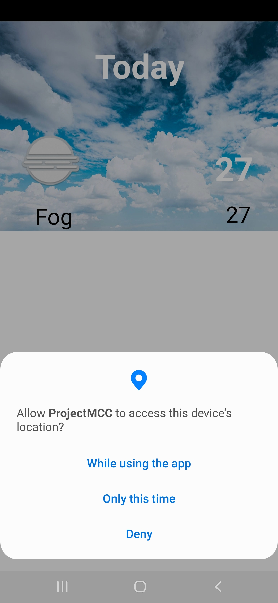
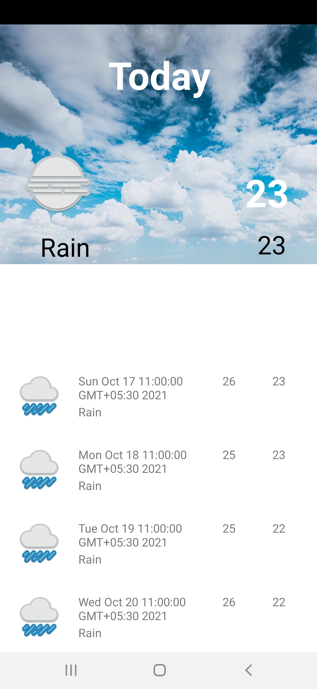

# Weather ☁️   Application
Weather application 📱 built using Java ♨️ and showing best practices of 🛠️ API

# ⚙️ Features 
1. You can see current location weather
2. With various symbolic images
3. also see the temperature

# Download the Apk

Download Apk 

 

## ⚙️ Technology Used

  </a>  <a href="https://www.java.com" target="_blank">  

### API Link : 
<a href="https://api.openweathermap.org">Open Weather API</a>
 

## 📸 Screenshots

||||
|:----------------------------------------:|:-----------------------------------------:|:-----------------------------------------: |
|  |  |  |

## 📸 Video

 

  
  <h2 align="center">📝 Created by </h2>

<h3>Kunal Chaudhury</h3>

  
 
 
